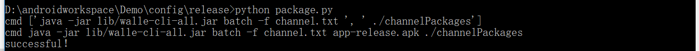
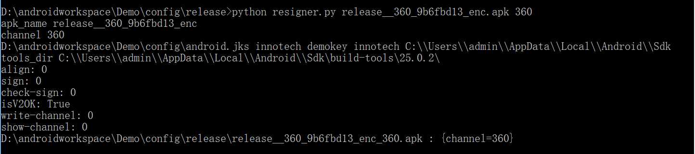

#Android apk渠道包处理
-------------

**简介**，对渠道打包规范整理，简化步骤，封装操作。

**封装成果**,只需一行指定即可完成渠道打包:

- 渠道打包：输入指令 python package.py
- 针对第三放平台加固后，重新签名打包：python resigner.py your.apk channel

**使用步骤**

一. 渠道打包

1. 配置环境，因为使用的python写的脚本。所以需要安装python3,并配置环境变量。
（在config/python，有python3 64位的安装文件，若不合适可去[官网下载](https://www.python.org/downloads/release/python-360/)）

2. 配置config/release/channel.txt文件 

3. 将你build好的apk，copy到config/release/，在**config/relase录下**执行命令：python package.py。结果会将当前目录下所有的apk，生成所有对应的渠道包到channelPackages/

二. 渠道获取

1. 在build.gradle中添加依赖：compile 'com.meituan.android.walle:library:1.1.6'

2. 调用api获取渠道：WalleChannelReader.getChannel(this.getApplicationContext())

         @Override
         protected void onCreate(Bundle savedInstanceState) {
            super.onCreate(savedInstanceState);
            setContentView(R.layout.activity_main);
            ((TextView)findViewById(R.id.tv_title)).setText("channel:" + WalleChannelReader.getChannel(this.getApplicationContext()));
        }

三. 针对第三方加固后，重新签名打包

1. 将config整个文件夹，copy到你的项目中（推荐，参考demo）

2. 因为涉及到签名，需将jks放在config/目录下，配置相应的signing.properties

3. 将第三方加固了的apk，copy到config/relase/，在**config/relase录下**执行命令：
python resigner.py your.apk channel。例如python resigner.py release__360_9b6fbd13_enc.apk 360。就会想当前目录下生成需要apk文件。

(**注意your.apk的文件名，不要以 - 等一些特殊字符开头**)

**原理解析**

[美团Android新一代渠道包生成工具](https://tech.meituan.com/android-apk-v2-signature-scheme.html)